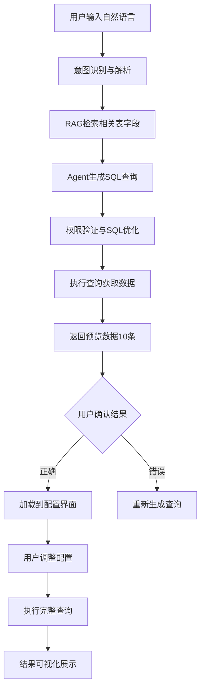

# AI智能自助取数平台技术方案

## 1. 项目概述

### 1.1 项目背景
基于AI Native实践大作业要求，结合腾讯云自助取数平台的成功实践，设计一个融合RAG、Agent、Prompt Engineering和MCP等AI技术的智能自助取数平台。该平台旨在让业务人员通过自然语言交互，快速、准确地获取所需数据，提升数据获取效率。

### 1.2 核心目标
- **降低取数门槛**：业务人员无需掌握SQL，通过自然语言即可取数
- **提升取数效率**：AI辅助快速生成查询条件，秒级响应数据请求
- **保证数据安全**：完善的权限控制和数据脱敏机制
- **优化用户体验**：智能推荐、实时预览、可视化展示

### 1.3 技术创新点
- **RAG增强检索**：基于数据字典和历史查询的智能推荐
- **Agent智能代理**：多步骤推理完成复杂取数任务
- **Prompt工程**：精准的自然语言到SQL转换
- **MCP协议**：统一的模型调用和管理

## 2. 技术架构设计

### 2.1 整体架构

```
┌─────────────────────────────────────────────────────────────┐
│                    前端展示层 (React/Vue)                    │
├─────────────────────────────────────────────────────────────┤
│  列表管理模块  │  练习场模块  │  可视化模块  │  用户管理模块  │
├─────────────────────────────────────────────────────────────┤
│                      API网关层 (FastAPI)                     │
├─────────────────────────────────────────────────────────────┤
│    AI服务层    │   取数服务层   │   权限服务层   │   缓存层    │
├─────────────────────────────────────────────────────────────┤
│  RAG检索引擎  │  Agent代理   │  Prompt引擎  │  MCP协议层   │
├─────────────────────────────────────────────────────────────┤
│              数据存储层 (MySQL + Redis + Vector DB)          │
└─────────────────────────────────────────────────────────────┘
```

### 2.2 核心技术栈

#### 2.2.1 前端技术
- **框架**：React 18 + TypeScript
- **UI组件**：Ant Design / Material-UI
- **状态管理**：Redux Toolkit / Zustand
- **图表库**：ECharts / D3.js
- **代码编辑器**：Monaco Editor (SQL编辑)

#### 2.2.2 后端技术
- **API框架**：FastAPI (Python)
- **AI框架**：LangChain + LangGraph
- **数据库**：MySQL 8.0 (主数据) + Redis (缓存) + ChromaDB (向量存储)
- **消息队列**：Redis Pub/Sub
- **部署**：Docker + Kubernetes

#### 2.2.3 AI技术组件
- **大模型**：OpenAI GPT-4 / Claude-3.5 / 通义千问
- **向量数据库**：ChromaDB / Pinecone
- **Embedding模型**：text-embedding-ada-002
- **MCP协议**：统一模型调用接口

## 3. AI核心功能设计

### 3.1 RAG增强检索系统

#### 3.1.1 知识库构建
```python
# 数据字典向量化存储
class DataDictionaryRAG:
    def __init__(self):
        self.vector_store = ChromaDB()
        self.embeddings = OpenAIEmbeddings()
    
    def build_knowledge_base(self):
        # 表结构信息
        table_docs = self.extract_table_schemas()
        # 字段描述信息
        field_docs = self.extract_field_descriptions()
        # 历史查询模式
        query_patterns = self.extract_query_patterns()
        
        # 向量化存储
        self.vector_store.add_documents(
            table_docs + field_docs + query_patterns
        )
```

#### 3.1.2 智能检索流程
1. **用户输入解析**：提取关键词和意图
2. **相似度检索**：在向量库中查找相关表和字段
3. **上下文增强**：结合用户历史和权限信息
4. **结果排序**：按相关度和可用性排序

#### 3.1.3 实际实现与使用场景（Playground 勾选“使用 RAG”）
- 适用场景：
  - 增强 SQL 生成准确性：基于数据字典、历史查询指南等片段，改善主表选择、字段命名、过滤与聚合写法。
  - 降低幻觉风险：遇到业务术语或表结构不清晰时，用可追溯片段作为依据。
  - 结合用户上下文：前端可额外传入 `context`（业务约束/数据源说明），与检索片段共同进入提示词。

- 前端触发点：
  - 页面：`frontend/src/pages/Playground.tsx`
  - 行为：复选框 `useRag` 勾选后，点击“问一问/生成”调用后端接口并携带 `use_rag`。
  - 请求体：`POST /api/v1/ai/query`，包含 `query`（自然语言）、`context`（可选）、`use_rag`（布尔）。

- 后端流程：
  - 路由：`backend/app/api/v1/ai.py` 的 `POST /api/v1/ai/query`，请求模型 `AIQueryRequest`、响应模型 `AIQueryResponse`（见 `backend/app/schemas/ai.py`）。
  - 当 `use_rag=true`：`AIService.generate_sql` 调用 `RAGService().get_context_for_query(nl_query, top_k=4)` 检索片段。
  - 提示词拼装：`backend/app/services/prompt.py` 的 `build_sql_generation_prompt` 将检索到的片段作为“参考数据上下文”注入，用于 SQL 生成。
  - 结果解析：将生成的 SQL 做启发式解析，返回 `tables/selected_table/dimensions/metrics/filters/sorts` 便于前端展示与后续执行。

- RAG 服务实现：
  - 位置：`backend/app/services/rag.py`
  - 存储：`chromadb.PersistentClient` + 配置项（持久化目录、集合名）；集合通过 `get_or_create_collection` 获取。
  - 能力：
    - `upsert_documents(docs)`：入库文档片段（`{id, text, source}`）。
    - `query(text, top_k)`：向量检索返回最相关片段（文本与来源）。
    - `get_context_for_query(text, top_k)`：将片段拼接为多行字符串 `[来源:source] text`；直接注入提示词。
  - 测试脚本：`backend/scripts/test_rag.py` 展示插入与检索用法，可用于初始化或手动验证。

- 配置与部署：
  - `backend/app/core/config.py`
    - `CHROMA_PERSIST_DIRECTORY`（默认 `./chroma_db`）：向量库持久化目录。
    - `CHROMA_COLLECTION_NAME`（默认 `query_embeddings`）：集合名称。
  - `docker/docker-compose.yml`：后端容器将 `CHROMA_PERSIST_DIRECTORY` 映射为 `/app/chroma_data` 并挂载 `chroma_data` 卷；同时提供 `chroma` 独立服务用于数据持久化（当前实现以内嵌客户端连接持久化目录为主）。
  - 降级策略：如 `chromadb` 未安装或集合不可用，`RAGService` 自动降级为无操作（返回空上下文），后端仍可生成占位或无 RAG 的 SQL，保证服务稳健性。

- 当前限制与改进建议：
  - 文档入口：暂无对外文档上传/管理 API 与前端上传页面（现用脚本入库），建议新增 `POST /api/v1/rag/documents` 用于上传/删除/查询并统一分片与解析。
  - 检索策略：仅单一向量检索，建议引入 BM25/混合检索、重排序与查询改写提升精度。
  - 响应展示：未在响应中显式返回检索片段列表与来源，建议在 `AIQueryResponse` 增加 `rag_context/rag_chunks`，前端展示“引用来源”。
  - 可观测性：新增“查看提示词”调试开关便于排查与调优；参数化 `top_k`（默认4，推荐 3–7）。

> 运行建议：生产环境设置 `CHROMA_PERSIST_DIRECTORY` 为持久卷路径并备份；配置 `OPENAI_API_KEY/AI_MODEL_NAME` 保证模型调用；如需彻底关闭调试痕迹，将 `backend/.env` 中 `DEBUG=false` 并重启服务。

### 3.2 Agent智能代理系统

#### 3.2.1 多Agent协作架构
```python
class DataQueryAgent:
    def __init__(self):
        self.intent_agent = IntentAnalysisAgent()      # 意图识别
        self.schema_agent = SchemaRetrievalAgent()     # 表结构检索
        self.sql_agent = SQLGenerationAgent()          # SQL生成
        self.validation_agent = ValidationAgent()      # 结果验证
        self.optimization_agent = OptimizationAgent()  # 查询优化
```

#### 3.2.2 Agent工作流程
1. **意图识别Agent**：分析用户需求，识别查询类型
2. **模式检索Agent**：基于RAG检索相关表和字段
3. **SQL生成Agent**：将自然语言转换为SQL查询
4. **验证Agent**：检查SQL语法和权限合规性
5. **优化Agent**：优化查询性能和结果展示

### 3.3 Prompt工程系统

#### 3.3.1 分层Prompt设计
```python
# 系统级Prompt
SYSTEM_PROMPT = """
你是一个专业的数据分析师，擅长将自然语言转换为精确的SQL查询。
数据库类型：MySQL 8.0
当前用户权限：{user_permissions}
可用表结构：{available_tables}
"""

# 任务级Prompt
TASK_PROMPT = """
基于用户需求：{user_query}
相关表信息：{relevant_tables}
生成SQL查询，要求：
1. 语法正确且高效
2. 遵循权限限制
3. 包含必要的数据验证
4. 限制返回结果数量（默认10条）
"""
```

#### 3.3.2 Few-shot学习样例
```python
FEW_SHOT_EXAMPLES = [
    {
        "input": "查询最近一周的销售数据",
        "output": """
        SELECT date, SUM(amount) as total_sales
        FROM sales_table 
        WHERE date >= DATE_SUB(CURDATE(), INTERVAL 7 DAY)
        GROUP BY date
        ORDER BY date DESC
        LIMIT 10;
        """
    },
    # 更多样例...
]
```

### 3.4 MCP协议集成

#### 3.4.1 统一模型调用接口
```python
class MCPModelManager:
    def __init__(self):
        self.models = {
            'gpt-4': OpenAIModel(),
            'claude-3.5': AnthropicModel(),
            'qwen': QwenModel()
        }
    
    async def call_model(self, model_name: str, prompt: str, **kwargs):
        model = self.models.get(model_name)
        return await model.generate(prompt, **kwargs)
```

#### 3.4.2 模型选择策略
- **简单查询**：使用轻量级模型（GPT-3.5）
- **复杂分析**：使用高性能模型（GPT-4）
- **代码生成**：使用专业模型（Claude-3.5）

## 4. 核心业务流程

### 4.1 自然语言取数流程



### 4.2 智能配置界面流程

1. **AI预填充**：基于自然语言自动填充维度、指标、筛选条件
2. **智能推荐**：推荐相关字段和常用筛选条件
3. **实时预览**：配置变更时实时显示数据预览
4. **一键优化**：AI建议查询优化方案

### 4.3 查询结果处理

1. **数据脱敏**：根据用户权限自动脱敏敏感数据
2. **格式化展示**：智能识别数据类型并格式化
3. **可视化推荐**：基于数据特征推荐合适的图表类型
4. **导出功能**：支持Excel、CSV、PDF等格式导出

## 5. 前端模块设计

### 5.1 列表管理模块

#### 5.1.1 功能特性
- **查询列表**：展示用户的所有查询记录
- **分类管理**：按业务主题、创建时间等分类
- **搜索过滤**：支持关键词搜索和多维度筛选
- **批量操作**：批量删除、导出、分享

#### 5.1.2 页面结构
```jsx
// 查询列表页面
const QueryListPage = () => {
  return (
    <div className="query-list-container">
      <SearchBar onSearch={handleSearch} />
      <FilterPanel filters={filters} onChange={handleFilterChange} />
      <QueryTable 
        data={queries}
        onEdit={handleEdit}
        onDelete={handleDelete}
        onShare={handleShare}
      />
      <Pagination total={total} onChange={handlePageChange} />
    </div>
  );
};
```

#### 5.1.3 详情页功能
- **查询详情**：显示SQL、执行时间、结果统计
- **结果预览**：表格和图表形式展示数据
- **历史版本**：查看查询的修改历史
- **分享设置**：设置分享权限和有效期

### 5.2 练习场模块

#### 5.2.1 功能设计
- **自然语言输入**：支持语音和文本输入
- **实时AI对话**：与AI助手实时交互优化查询
- **SQL编辑器**：Monaco Editor支持语法高亮和自动补全
- **结果预览**：实时显示查询结果

#### 5.2.2 交互流程
```jsx
const PlaygroundPage = () => {
  const [conversation, setConversation] = useState([]);
  const [sqlQuery, setSqlQuery] = useState('');
  const [results, setResults] = useState([]);

  const handleNaturalLanguageInput = async (input) => {
    // 调用AI服务生成SQL
    const response = await aiService.generateSQL(input);
    setSqlQuery(response.sql);
    
    // 执行预览查询
    const previewResults = await dataService.executePreview(response.sql);
    setResults(previewResults);
  };

  return (
    <div className="playground-container">
      <ChatInterface 
        conversation={conversation}
        onSend={handleNaturalLanguageInput}
      />
      <SQLEditor 
        value={sqlQuery}
        onChange={setSqlQuery}
      />
      <ResultsPreview data={results} />
    </div>
  );
};
```

### 5.3 可视化模块

#### 5.3.1 图表类型支持
- **基础图表**：柱状图、折线图、饼图、散点图
- **高级图表**：热力图、桑基图、雷达图、漏斗图
- **地理图表**：地图、轨迹图
- **实时图表**：支持数据实时更新

#### 5.3.2 智能推荐算法
```python
def recommend_chart_type(data_info):
    """基于数据特征推荐图表类型"""
    if data_info.has_time_series:
        return ['line_chart', 'area_chart']
    elif data_info.has_categories and data_info.has_numeric:
        return ['bar_chart', 'column_chart']
    elif data_info.has_geographic:
        return ['map_chart', 'scatter_map']
    else:
        return ['table_view']
```

## 6. 后端API设计

### 6.1 核心API接口

#### 6.1.1 AI查询接口
```python
@app.post("/api/v1/ai/query")
async def ai_query(request: AIQueryRequest):
    """自然语言查询接口"""
    try:
        # 1. 意图识别
        intent = await intent_service.analyze(request.query)
        
        # 2. RAG检索
        context = await rag_service.retrieve(request.query, request.user_id)
        
        # 3. SQL生成
        sql_result = await agent_service.generate_sql(
            query=request.query,
            context=context,
            user_permissions=request.user_permissions
        )
        
        # 4. 预览执行
        preview_data = await data_service.execute_preview(sql_result.sql)
        
        return AIQueryResponse(
            sql=sql_result.sql,
            explanation=sql_result.explanation,
            preview_data=preview_data,
            confidence=sql_result.confidence
        )
    except Exception as e:
        raise HTTPException(status_code=500, detail=str(e))
```

#### 6.1.2 数据查询接口
```python
@app.post("/api/v1/data/execute")
async def execute_query(request: ExecuteQueryRequest):
    """执行数据查询"""
    # 权限验证
    await permission_service.validate_query(request.sql, request.user_id)
    
    # 查询优化
    optimized_sql = await optimizer_service.optimize(request.sql)
    
    # 执行查询
    results = await data_service.execute_query(optimized_sql)
    
    # 数据脱敏
    sanitized_results = await security_service.sanitize_data(
        results, request.user_id
    )
    
    return ExecuteQueryResponse(
        data=sanitized_results,
        total_count=len(sanitized_results),
        execution_time=results.execution_time
    )
```

#### 6.1.3 配置管理接口
```python
@app.post("/api/v1/config/save")
async def save_query_config(request: SaveConfigRequest):
    """保存查询配置"""
    config = QueryConfig(
        name=request.name,
        description=request.description,
        sql=request.sql,
        parameters=request.parameters,
        user_id=request.user_id,
        created_at=datetime.now()
    )
    
    config_id = await config_service.save(config)
    return {"config_id": config_id, "message": "配置保存成功"}
```

### 6.2 权限控制系统

#### 6.2.1 多级权限设计
```python
class PermissionLevel(Enum):
    TABLE_LEVEL = "table"      # 表级权限
    COLUMN_LEVEL = "column"    # 字段级权限
    ROW_LEVEL = "row"          # 行级权限
    VALUE_LEVEL = "value"      # 值级权限（脱敏）

class PermissionService:
    async def validate_query(self, sql: str, user_id: str):
        """验证查询权限"""
        parsed_sql = self.parse_sql(sql)
        
        # 检查表权限
        for table in parsed_sql.tables:
            if not await self.has_table_permission(user_id, table):
                raise PermissionError(f"无权访问表: {table}")
        
        # 检查字段权限
        for column in parsed_sql.columns:
            if not await self.has_column_permission(user_id, column):
                raise PermissionError(f"无权访问字段: {column}")
        
        return True
```

### 6.3 缓存策略

#### 6.3.1 多层缓存设计
```python
class CacheService:
    def __init__(self):
        self.redis_client = Redis()
        self.local_cache = TTLCache(maxsize=1000, ttl=300)
    
    async def get_query_result(self, sql_hash: str):
        """获取查询结果缓存"""
        # 1. 本地缓存
        if sql_hash in self.local_cache:
            return self.local_cache[sql_hash]
        
        # 2. Redis缓存
        cached_result = await self.redis_client.get(f"query:{sql_hash}")
        if cached_result:
            result = json.loads(cached_result)
            self.local_cache[sql_hash] = result
            return result
        
        return None
    
    async def set_query_result(self, sql_hash: str, result: dict, ttl: int = 3600):
        """设置查询结果缓存"""
        # 存储到Redis
        await self.redis_client.setex(
            f"query:{sql_hash}", 
            ttl, 
            json.dumps(result)
        )
        # 存储到本地缓存
        self.local_cache[sql_hash] = result
```

## 7. 数据安全与合规

### 7.1 数据脱敏策略

#### 7.1.1 敏感数据识别
```python
class DataSensitivityDetector:
    def __init__(self):
        self.patterns = {
            'phone': r'1[3-9]\d{9}',
            'email': r'[\w\.-]+@[\w\.-]+\.\w+',
            'id_card': r'\d{17}[\dXx]',
            'bank_card': r'\d{16,19}'
        }
    
    def detect_sensitive_columns(self, data: pd.DataFrame):
        """检测敏感字段"""
        sensitive_columns = []
        for column in data.columns:
            if self.is_sensitive_column(data[column]):
                sensitive_columns.append(column)
        return sensitive_columns
```

#### 7.1.2 脱敏处理方法
```python
class DataMaskingService:
    def mask_phone(self, phone: str) -> str:
        """手机号脱敏"""
        return phone[:3] + '****' + phone[-4:]
    
    def mask_email(self, email: str) -> str:
        """邮箱脱敏"""
        username, domain = email.split('@')
        masked_username = username[:2] + '***' + username[-1:]
        return f"{masked_username}@{domain}"
    
    def mask_id_card(self, id_card: str) -> str:
        """身份证脱敏"""
        return id_card[:6] + '********' + id_card[-4:]
```

### 7.2 审计日志系统

#### 7.2.1 操作日志记录
```python
class AuditLogger:
    async def log_query_execution(self, user_id: str, sql: str, result_count: int):
        """记录查询执行日志"""
        log_entry = {
            'user_id': user_id,
            'action': 'QUERY_EXECUTION',
            'sql_hash': hashlib.md5(sql.encode()).hexdigest(),
            'result_count': result_count,
            'timestamp': datetime.now(),
            'ip_address': self.get_client_ip(),
            'user_agent': self.get_user_agent()
        }
        await self.save_audit_log(log_entry)
```

## 8. 性能优化策略

### 8.1 查询优化

#### 8.1.1 SQL优化建议
```python
class QueryOptimizer:
    def optimize_sql(self, sql: str) -> str:
        """SQL查询优化"""
        optimizations = [
            self.add_limit_clause,      # 添加LIMIT限制
            self.optimize_joins,        # 优化JOIN操作
            self.add_indexes_hint,      # 添加索引提示
            self.optimize_where_clause  # 优化WHERE条件
        ]
        
        optimized_sql = sql
        for optimization in optimizations:
            optimized_sql = optimization(optimized_sql)
        
        return optimized_sql
```

#### 8.1.2 查询监控
```python
class QueryMonitor:
    async def monitor_query_performance(self, sql: str):
        """监控查询性能"""
        start_time = time.time()
        
        # 执行查询
        result = await self.execute_query(sql)
        
        execution_time = time.time() - start_time
        
        # 记录性能指标
        await self.record_performance_metrics({
            'sql_hash': hashlib.md5(sql.encode()).hexdigest(),
            'execution_time': execution_time,
            'result_count': len(result),
            'timestamp': datetime.now()
        })
        
        # 慢查询告警
        if execution_time > 10:  # 超过10秒
            await self.send_slow_query_alert(sql, execution_time)
```

### 8.2 前端性能优化

#### 8.2.1 虚拟滚动
```jsx
// 大数据量表格虚拟滚动
const VirtualTable = ({ data, columns }) => {
  const [visibleRange, setVisibleRange] = useState({ start: 0, end: 50 });
  
  const handleScroll = useCallback((scrollTop) => {
    const itemHeight = 40;
    const containerHeight = 600;
    const start = Math.floor(scrollTop / itemHeight);
    const end = start + Math.ceil(containerHeight / itemHeight);
    
    setVisibleRange({ start, end });
  }, []);
  
  const visibleData = data.slice(visibleRange.start, visibleRange.end);
  
  return (
    <VirtualScrollContainer onScroll={handleScroll}>
      {visibleData.map((row, index) => (
        <TableRow key={visibleRange.start + index} data={row} />
      ))}
    </VirtualScrollContainer>
  );
};
```

#### 8.2.2 数据分页加载
```jsx
const useInfiniteQuery = (queryFn, pageSize = 20) => {
  const [data, setData] = useState([]);
  const [loading, setLoading] = useState(false);
  const [hasMore, setHasMore] = useState(true);
  
  const loadMore = useCallback(async () => {
    if (loading || !hasMore) return;
    
    setLoading(true);
    try {
      const newData = await queryFn(data.length, pageSize);
      setData(prev => [...prev, ...newData]);
      setHasMore(newData.length === pageSize);
    } finally {
      setLoading(false);
    }
  }, [data.length, loading, hasMore, queryFn, pageSize]);
  
  return { data, loading, hasMore, loadMore };
};
```

## 9. 部署方案

### 9.1 Docker容器化

#### 9.1.1 Dockerfile配置
```dockerfile
# 前端构建
FROM node:18-alpine AS frontend-build
WORKDIR /app/frontend
COPY frontend/package*.json ./
RUN npm ci --only=production
COPY frontend/ ./
RUN npm run build

# 后端服务
FROM python:3.11-slim AS backend
WORKDIR /app
COPY requirements.txt ./
RUN pip install --no-cache-dir -r requirements.txt
COPY backend/ ./
COPY --from=frontend-build /app/frontend/dist ./static

EXPOSE 8000
CMD ["uvicorn", "main:app", "--host", "0.0.0.0", "--port", "8000"]
```

#### 9.1.2 Docker Compose配置
```yaml
version: '3.8'
services:
  app:
    build: .
    ports:
      - "8000:8000"
    environment:
      - DATABASE_URL=mysql://user:password@db:3306/ai_query_platform
      - REDIS_URL=redis://redis:6379
    depends_on:
      - db
      - redis
      - vector-db

  db:
    image: mysql:8.0
    environment:
      MYSQL_ROOT_PASSWORD: rootpassword
      MYSQL_DATABASE: ai_query_platform
    volumes:
      - mysql_data:/var/lib/mysql

  redis:
    image: redis:7-alpine
    volumes:
      - redis_data:/data

  vector-db:
    image: chromadb/chroma:latest
    ports:
      - "8001:8000"
    volumes:
      - chroma_data:/chroma/chroma

volumes:
  mysql_data:
  redis_data:
  chroma_data:
```

### 9.2 Kubernetes部署

#### 9.2.1 应用部署配置
```yaml
apiVersion: apps/v1
kind: Deployment
metadata:
  name: ai-query-platform
spec:
  replicas: 3
  selector:
    matchLabels:
      app: ai-query-platform
  template:
    metadata:
      labels:
        app: ai-query-platform
    spec:
      containers:
      - name: app
        image: ai-query-platform:latest
        ports:
        - containerPort: 8000
        env:
        - name: DATABASE_URL
          valueFrom:
            secretKeyRef:
              name: db-secret
              key: url
        resources:
          requests:
            memory: "512Mi"
            cpu: "250m"
          limits:
            memory: "1Gi"
            cpu: "500m"
```

## 10. 监控与运维

### 10.1 应用监控

#### 10.1.1 健康检查
```python
@app.get("/health")
async def health_check():
    """应用健康检查"""
    checks = {
        'database': await check_database_connection(),
        'redis': await check_redis_connection(),
        'vector_db': await check_vector_db_connection(),
        'ai_service': await check_ai_service_availability()
    }
    
    all_healthy = all(checks.values())
    status_code = 200 if all_healthy else 503
    
    return JSONResponse(
        status_code=status_code,
        content={
            'status': 'healthy' if all_healthy else 'unhealthy',
            'checks': checks,
            'timestamp': datetime.now().isoformat()
        }
    )
```

#### 10.1.2 性能指标收集
```python
from prometheus_client import Counter, Histogram, Gauge

# 定义指标
query_counter = Counter('queries_total', 'Total number of queries', ['status'])
query_duration = Histogram('query_duration_seconds', 'Query execution time')
active_users = Gauge('active_users', 'Number of active users')

class MetricsMiddleware:
    async def __call__(self, request: Request, call_next):
        start_time = time.time()
        
        response = await call_next(request)
        
        # 记录请求耗时
        duration = time.time() - start_time
        query_duration.observe(duration)
        
        # 记录请求状态
        query_counter.labels(status=response.status_code).inc()
        
        return response
```

### 10.2 日志管理

#### 10.2.1 结构化日志
```python
import structlog

logger = structlog.get_logger()

class LoggingService:
    def log_query_execution(self, user_id: str, sql: str, execution_time: float):
        logger.info(
            "Query executed",
            user_id=user_id,
            sql_hash=hashlib.md5(sql.encode()).hexdigest(),
            execution_time=execution_time,
            event_type="query_execution"
        )
    
    def log_error(self, error: Exception, context: dict):
        logger.error(
            "Application error",
            error_type=type(error).__name__,
            error_message=str(error),
            context=context,
            event_type="error"
        )
```

## 11. 测试策略

### 10.3 环境升级与依赖修复（Windows/Conda）

为确保向量检索（RAG）稳定运行并启用 ChromaDB，本节提供在 Windows 环境下将后端升级至 64 位 Python 3.11 的完整操作指南，同时记录依赖冲突的修复策略与验证方法。

#### 10.3.1 背景与问题定位
- 问题现象：后端 RAG 功能降级，日志提示 `chromadb` 安装失败或初始化异常；检索被临时切换为 JSONL 回退存储（`fallback_rag_store.jsonl`）。
- 根因分析：开发机为 32 位 Python 环境，`chromadb` 及其依赖不支持 32 位架构，导致安装与运行失败。
- 目标方案：使用 Conda 创建 64 位 Python 3.11 环境，安装并启用 `chromadb`，恢复向量检索能力。

#### 10.3.2 升级步骤（操作清单）
1. 检查 Conda 安装：
   - 运行：`conda --version`
   - 如未安装，请先安装 Miniconda（64 位），并将其加入系统 PATH。
2. 创建并激活 64 位 Python 3.11 环境：
   - 创建：`conda create -n aitt-py311 python=3.11 -y`
   - 激活：`conda activate aitt-py311`
3. 验证架构为 64 位：
   - 执行：`python -c "import platform,struct;print(platform.architecture()[0], struct.calcsize('P')*8)"`
   - 预期输出：`64bit 64`
4. 安装与升级基础依赖：
   - `conda install -y -c conda-forge numpy`
   - `python -m pip install --upgrade pip setuptools wheel`
5. 修复后端依赖冲突并安装依赖：
   - 依赖冲突：`langchain-openai==0.0.2` 依赖 `openai>=1.6.1,<2.0.0`。
   - 已在 `backend/requirements.txt` 将 `openai` 调整为 `>=1.6.1,<2.0.0`，确保与 `langchain-openai` 兼容。
   - 安装：`pip install -r backend/requirements.txt`
6. 安装邮件校验扩展（用于 Pydantic 相关模型）：
   - `python -m pip install "pydantic[email]"`
7. 启动后端并观察日志：
   - 启动：`uvicorn backend.app.main:app --host 0.0.0.0 --port 8000 --log-level info`
   - 关注日志：确认 `ChromaDB PersistentClient` 初始化成功，持久化目录可写。

#### 10.3.3 RAG 功能验证（端到端）
1. 写入测试文档：
   - `POST /api/v1/rag/documents`
   - 请求示例：
     ```json
     {
       "documents": [
         {"id": "conda-test-1", "text": "CSS 选择器基础用法……", "source": "conda-test"}
       ]
     }
     ```
   - 预期：返回 `success=true`，插入计数为 1。
2. 检索测试内容：
   - `GET /api/v1/rag/search?query=选择器&top_k=4`
   - 预期：返回包含 `source="conda-test"` 的相关文本片段。
3. 持久化检查：
   - 配置项 `CHROMA_PERSIST_DIRECTORY` 指向的目录生成/更新索引文件，重启后端后检索结果仍可复现。

#### 10.3.4 历史数据迁移（从回退存储到 ChromaDB）
- 回退存储文件：`backend/fallback_rag_store.jsonl`
- 迁移建议：新增迁移脚本（示例流程）。
  - 读取 JSONL：逐行解析 `{id, text, source}`。
  - 调用 `RAGService.upsert_documents(docs)` 批量入库。
  - 去重策略：以 `id` 为主键，如重复则更新文本与来源。
- 示例伪代码：
  ```python
  from backend.app.services.rag import RAGService
  import json

  def migrate_fallback_to_chroma(path="backend/fallback_rag_store.jsonl"):
      rag = RAGService()
      docs = []
      with open(path, "r", encoding="utf-8") as f:
          for line in f:
              obj = json.loads(line)
              docs.append({"id": obj["id"], "text": obj["text"], "source": obj.get("source", "fallback")})
      rag.upsert_documents(docs)
  ```

#### 10.3.5 配置项与运维建议
- 关键配置（`backend/app/core/config.py` 与环境变量）：
  - `CHROMA_PERSIST_DIRECTORY`：向量库持久化目录（建议使用持久卷）。
  - `CHROMA_COLLECTION_NAME`：集合名称（默认 `query_embeddings`）。
  - `OPENAI_API_KEY`：大模型调用密钥；`AI_MODEL_NAME` 对应模型名称。
- 运维建议：
  - 定期备份 `CHROMA_PERSIST_DIRECTORY`，并在部署中挂载持久卷。
  - 通过健康检查与日志观察 RAG 初始化与检索耗时，必要时调优 `top_k` 与分片策略。
  - 如遇异常可临时启用回退存储，待环境修复后执行迁移脚本恢复数据。


### 11.1 单元测试

#### 11.1.1 AI服务测试
```python
import pytest
from unittest.mock import Mock, patch

class TestAIQueryService:
    @pytest.fixture
    def ai_service(self):
        return AIQueryService()
    
    @patch('ai_service.openai_client')
    async def test_generate_sql_success(self, mock_openai, ai_service):
        # 模拟OpenAI响应
        mock_openai.chat.completions.create.return_value = Mock(
            choices=[Mock(message=Mock(content="SELECT * FROM users LIMIT 10;"))]
        )
        
        result = await ai_service.generate_sql("查询用户信息")
        
        assert result.sql == "SELECT * FROM users LIMIT 10;"
        assert result.confidence > 0.8
    
    async def test_generate_sql_with_invalid_input(self, ai_service):
        with pytest.raises(ValueError):
            await ai_service.generate_sql("")
```

### 11.2 集成测试

#### 11.2.1 API集成测试
```python
import pytest
from httpx import AsyncClient

class TestQueryAPI:
    @pytest.fixture
    async def client(self):
        async with AsyncClient(app=app, base_url="http://test") as ac:
            yield ac
    
    async def test_ai_query_endpoint(self, client):
        response = await client.post(
            "/api/v1/ai/query",
            json={
                "query": "查询最近一周的销售数据",
                "user_id": "test_user"
            }
        )
        
        assert response.status_code == 200
        data = response.json()
        assert "sql" in data
        assert "preview_data" in data
        assert len(data["preview_data"]) <= 10
```

### 11.3 端到端测试

#### 11.3.1 Playwright自动化测试
```javascript
const { test, expect } = require('@playwright/test');

test('自然语言查询流程', async ({ page }) => {
  // 登录
  await page.goto('/login');
  await page.fill('[data-testid=username]', 'testuser');
  await page.fill('[data-testid=password]', 'password');
  await page.click('[data-testid=login-button]');

  // 进入练习场
  await page.goto('/playground');
  
  // 输入自然语言查询
  await page.fill('[data-testid=query-input]', '查询最近一周的销售数据');
  await page.click('[data-testid=submit-button]');
  
  // 验证结果
  await expect(page.locator('[data-testid=sql-editor]')).toBeVisible();
  await expect(page.locator('[data-testid=results-table]')).toBeVisible();
  
  // 确认并加载到配置界面
  await page.click('[data-testid=confirm-button]');
  await expect(page.locator('[data-testid=config-form]')).toBeVisible();
});
```

## 12. 项目实施计划

### 12.1 开发阶段规划

#### 第一阶段：基础架构搭建（2周）
- [ ] 项目初始化和环境配置
- [ ] 数据库设计和初始化
- [ ] 基础API框架搭建
- [ ] 前端项目初始化

#### 第二阶段：AI核心功能开发（3周）
- [ ] RAG检索系统实现
- [ ] Agent代理系统开发
- [ ] Prompt工程优化
- [ ] MCP协议集成

#### 第三阶段：前端功能开发（3周）
- [ ] 练习场模块开发
- [ ] 列表管理模块开发
- [ ] 可视化模块开发
- [ ] 用户权限管理

#### 第四阶段：系统集成与优化（2周）
- [ ] 前后端集成联调
- [ ] 性能优化和缓存
- [ ] 安全加固和测试
- [ ] 部署和上线准备

### 12.2 关键里程碑

1. **MVP版本**：实现基本的自然语言转SQL功能
2. **Beta版本**：完成核心功能和基础UI
3. **正式版本**：完整功能、性能优化、安全加固

### 12.3 风险控制

#### 技术风险
- **AI模型准确性**：建立评估体系，持续优化Prompt
- **性能瓶颈**：提前进行压力测试，优化查询性能
- **数据安全**：严格权限控制，完善审计机制

#### 项目风险
- **进度延期**：合理分解任务，建立缓冲时间
- **需求变更**：敏捷开发，快速响应变化
- **团队协作**：建立规范流程，加强沟通

## 13. 总结

本技术方案基于AI Native实践大作业要求，结合腾讯云自助取数平台的成功经验，设计了一个融合RAG、Agent、Prompt Engineering和MCP等先进AI技术的智能自助取数平台。

### 13.1 技术创新点

1. **RAG增强检索**：基于向量数据库的智能表结构和历史查询检索
2. **多Agent协作**：意图识别、模式检索、SQL生成、结果验证的完整流程
3. **精准Prompt工程**：分层设计、Few-shot学习、上下文增强
4. **统一MCP协议**：多模型调用管理，智能模型选择策略

### 13.2 业务价值

1. **降低使用门槛**：业务人员无需SQL知识即可快速取数
2. **提升工作效率**：AI辅助生成查询，秒级响应数据需求
3. **保障数据安全**：完善的权限控制和数据脱敏机制
4. **优化用户体验**：智能推荐、实时预览、可视化展示

### 13.3 扩展性设计

1. **模块化架构**：各组件独立部署，便于扩展和维护
2. **插件化设计**：支持自定义数据源和图表类型
3. **API优先**：完善的API设计，支持第三方集成
4. **云原生部署**：容器化部署，支持弹性伸缩

该方案不仅满足AI Native实践大作业的技术要求，更具备实际的商业应用价值，可以作为企业数字化转型的重要工具，助力数据驱动决策的普及和落地。